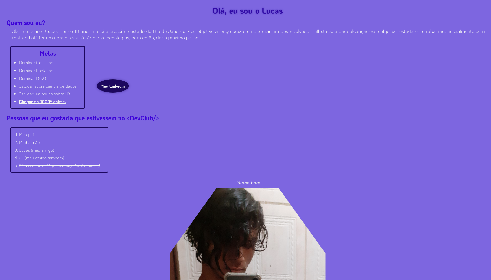

<h1 align="center">
    Who am i - DevClub Challenge 1
</h1>

> Introductory challenge to HTML and CSS
Access the project <a href="https://luk4x.github.io/DevClub-Desafio1-HTML/" target="_blank">HERE</a>.

## 🤝 Contributors
<table>
  <tr>
    <td align="center">
      <a href="https://www.linkedin.com/in/lucasmacielf/">
         
        
          <b>Lucas Maciel</b>
        
      </a>
    </td>
  </tr>
</table>
